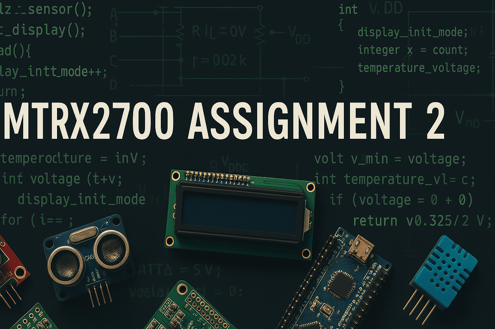

<p align="center">
  
</p>

# MTRX2700-Assignment-2 🤖
## Group Number - NAME **

### **Authors ✍️:**  
- **NAME**: SID  
- **Dylan George**: 530839244  
- **NAME**: SID 
- **NAME**: SID 

## Roles and Responsibilities 👷‍♂️

| Name            | Role                  | Responsibilities                      |  
|----------------|----------------------|--------------------------------------|  
| A  | ROLEA     | A |  
| Dylan      | ROLEB   | B |  
| B  | ROLEC    | C|  
| C    |  ROLED   | D | 

## Project Overview 📜
This repository was made to meet requirements for the ASM Lab (Assignment 2) as part of coursework in MTRX2700 (Mechatronics 2) at the **University of Sydney**. The code is mostly in the **C** coding language and was written for, and tested on, **STM32F3 Discovery** micro-controllers.  

The code is broken into separate modules, with sub-tasks for each module, each entailing their own respective files. Descriptions of each task, and how to run the code are explained in the drop-downs in the **Module Overview** section.  

It is recommended to create a new project in **STM32CubeIDE** using the downloaded Git repository (see details below). You can then run each sub-project by navigating into its respective directory or by manually copying individual files into a new project.

### How to Download the Repo ⬇️
Clone the repository in your terminal using:
   ```bash
   git clone https://github.com/dylangeorg3/MTRX2700-Assignment-2.git
   ```
Note that the repository is not publically available, for reasons pertaining to academic integrity.
## Module Overview 📂

## Requirements
### Software Requirements
- **STM32CubeIDE** (Required for building, debugging, and uploading code to the STM32F3Discovery board).
- **Serial Monitor Tool**
  - **Windows:** [PuTTY](https://www.putty.org/)
  - **MacOS:** [CuteCom](https://cutecom.sourceforge.io/)

### Hardware Requirements
- **One or Two STM32F3 Discovery Boards**
  - Two boards are required for **Exercise 3E** and **Integration**, connected via serial communication.
- **3 x 30AWG female to female jumper cables**
  - Required to connect the two boards in the aforementioned tasks
  - They are relatively cheap, and available at [Core Electronics](https://core-electronics.com.au/female-to-female-dupont-line-40-pin-10cm-24awg.html?gad_source=1&gclid=Cj0KCQjw4v6-BhDuARIsALprm32sz4oCAe0GOuz8QdB3mVvDaUouCLKruWdyOYjAz_SCJl4C5ngxbRAaAuPGEALw_wcB)


## Installation & Setup
### STM32CubeIDE Installation
1. Download STM32CubeIDE from [ST’s official website](https://www.st.com/en/development-tools/stm32cubeide.html).
2. Follow the installation instructions provided on the website for your operating system.

### Serial Monitor Installation
- **Windows (PuTTY):**
  1. Download from [PuTTY’s official website](https://www.putty.org/).
  2. Install using the provided installer.
- **MacOS (CuteCom):**
  1. Install via Homebrew (Recommended):
     ```bash
     brew install cutecom
     ```
  2. Or download from the [CuteCom website](https://cutecom.sourceforge.io/).


<details>
<summary><strong>Exercise 1 - Digital I/O 💡</strong></summary>

#### **Description**
Insert description

#### **Usage**
Insert how to use

### **Testing**
Insert how module was tested

</details>

---

<details>
<summary><strong>Exercise 2 - Serial Interface 📡</strong></summary>

#### **Description**
Insert description

#### **Usage**
Insert how to use

### **Testing**
Insert how module was tested

</details>

---

<details>
<summary><strong>Exercise 3 - Timer Interface ⏳</strong></summary>

#### **Description**
Insert description

#### **Usage**
Insert how to use

### **Testing**
Insert how module was tested


</details>

---

<details>
<summary><strong>Exercise 4 - Integration 🔄</strong></summary>

#### **Description**
Insert description

#### **Usage**
Insert how to use

### **Testing**
Insert how module was tested


</details>

---


## Testing and Troubleshooting 🧪
### Project Setup ⚙️
1. Move all files from each folder in this project into your STM32CubeIDE workspace.
2. Open STM32CubeIDE and import the project files as necessary.
3. Build the project and ensure there are no errors.


### Debugging 🐞
- To debug your program in STM32CubeIDE:
  1. Click on **Debug** to start the debugging process.
  2. Once debugging starts, click **Resume** to run the program.
  3. Transmit your data via serial communication using your chosen serial monitor tool.
  4. Click **Pause** in STM32CubeIDE to inspect what was received.


- Make sure all dependencies are installed and properly configured.
- If the IDE does not detect the STM32F3Discovery board, try restarting your IDE or reconnecting the board.
- If using a MAC, the dongle connectors can be temperamental. Try unplugging and retrying
- Ensure serial connections are properly established between the boards if required

  
---

## Minutes and Meeting Notes 📁

All meeting notes and agendas are stored in the `/minutes/` directory of this repository.


